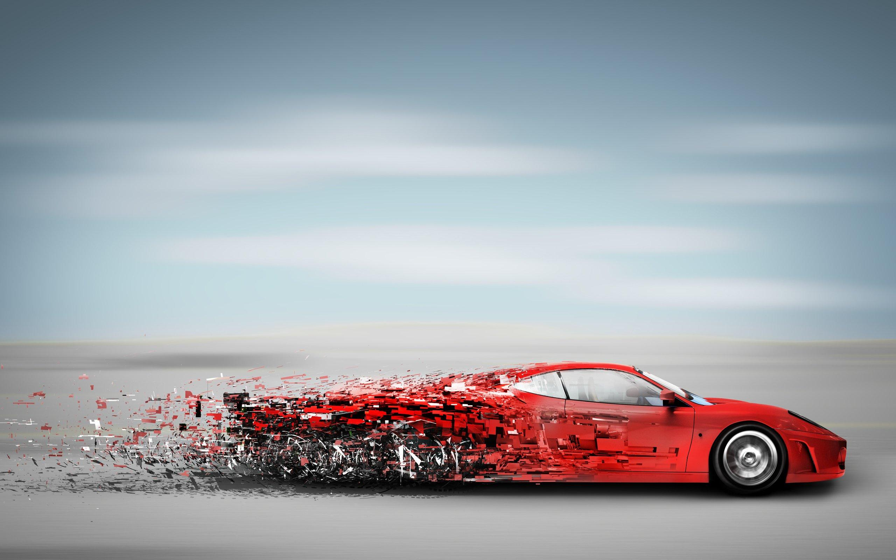

<!DOCTYPE html>
<html lang="ru">
<head>
    <meta charset="UTF-8">
    <meta name="viewport" content="width=device-width, initial-scale=1.0">
    <meta name="author" content="Glushnev Mikhail Alekseevich">
    <meta name="description" content="Сайт компании MAG Industries – будущая многомиллиардная компания по производству автомобилей и электроники в СНГ">
    <meta name="keywords" content="MAG industries, стартап, автомобили, электроника, 3D-принтер, Arduino, технологии, СНГ, инновации">
    <title>MAG Industries | Будущее — прямо сейчас</title>

    <link rel="preconnect" href="https://fonts.googleapis.com">
    <link rel="preconnect" href="https://fonts.gstatic.com" crossorigin>
    <link href="https://fonts.googleapis.com/css2?family=Montserrat:wght@400;600;700&family=Roboto:wght@300;400&display=swap" rel="stylesheet">

    
</head>
<body>
    <header>
        

            
MAG Industries

            

            <nav>
                <a href="https://mag858.github.io/mag_svas/">Связаться с нами</a>
                <a href="https://mag858.github.io/mag_idea/">Поделиться идеями</a>
                <a href="https://mag858.github.io/mag_opros/">Опрос по часам</a>
                <a href="https://mag858.github.io/opros_electronics/">Опрос по электронике</a>
                <a href="https://mag858.github.io/mag_help_me/">Помощь в развитии</a>
                <a href="https://mag858.github.io/mag_help_you/">Техническая помощь</a>
            </nav>
        

    </header>
    <section class="hero">
        
        <h1>future - right now</h1>
        
(будущее - прямо сейчас)

        
    </section>
    <section class="content">
        
Всем привет! Мы — будущая многомиллиардная компания MAG Industries, которая будет заниматься производством автомобилей на территории СНГ.

        
Мы хотим, чтобы вы помогли нам финансово или своим мнением о продукте, который мы планируем выпустить на авторынок.

        
Мы прекрасно понимаем, что создать автомобильную компанию с нуля крайне сложно, поэтому начинаем с небольших электронных устройств. Они будут постепенно перерастать в крупные проекты, приносящие прибыль для развития автомобилестроения.

        
Если у вас есть идеи — предлагайте их <a href="https://mag858.github.io/mag_idea/">здесь</a>.

    </section>
    <section class="gallery">
        <h2>Наши возможности</h2>
        

            
            
            
            
            
            
            
            
            
            
            
        

    </section>

    <!-- ХРОНОЛОГИЯ БЕЗ ЛИНИИ -->
    <section class="horizontal-timeline-section">
        <h2>Хронология создания часов</h2>
        

            <!-- КАРТОЧКА 1 -->
            

                
                

                    
Май 2022

                    
Первый прототип

                

            

            <!-- КАРТОЧКА 2 -->
            

                
                

                    
Май 2023

                    
Улучшенная версия корпуса

                

            

            <!-- КАРТОЧКА 3 -->
            

                
                

                    
Июль 2023

                    
Добавление дисплея

                

            

            <!-- КАРТОЧКА 4 -->
            

                
                

                    
Апрель 2024

                    
Функциональный образец

                

            

            <!-- КАРТОЧКА 5 -->
            

                
                

                    
Май 2025

                    
Предсерийный образец

                

            

            <!-- КАРТОЧКА 6 -->
            

                
                

                    
Декабрь 2025

                    
Финальная версия MAG Watch

                

            

        

    </section>

    <footer>
        обновление 3.2 &emsp; январь 2026 г.
    </footer>

    <!-- Анимация появления при прокрутке -->
    
</body>
</html>
